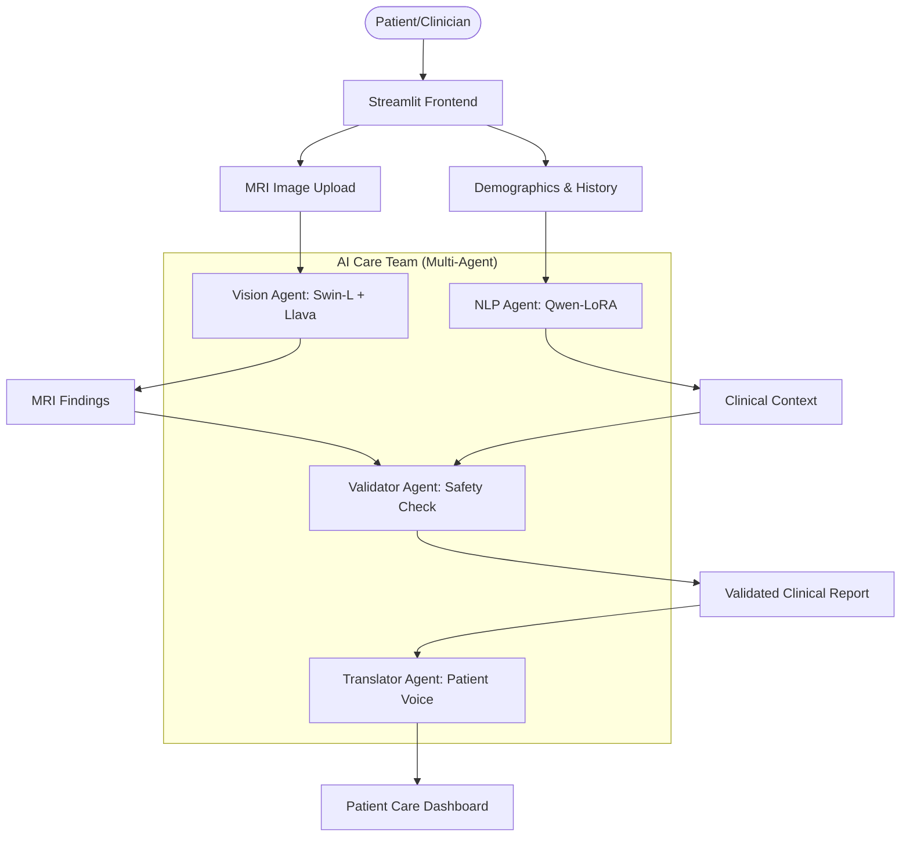

# Sciatica Prognosis AI: Full Project Documentation

## 1. Project Overview
**Sciatica Prognosis AI** is a state-of-the-art medical decision support system designed to assist clinicians and patients in diagnosing and managing sciatica. The system integrates advanced computer vision for MRI analysis with natural language processing for clinical report understanding, validated against established medical guidelines.

### Core Objectives:
- **Precision Diagnosis**: Use SOTA Swin Transformer architectures for high-accuracy MRI pathology detection.
- **Automated Clinical Context**: Extract symptoms and history from patient narratives using fine-tuned NLP agents.
- **Safety First**: Cross-reference visual findings with clinical data to validate prognosis safety.
- **Patient Empowerment**: Translate complex medical jargon into empathetic, patient-centric recovery plans.

---

## 2. Technical Architecture
The system follows a multi-agent orchestration pattern where each specialized agent handles a specific part of the diagnostic pipeline.



---

## 3. Deep Dive: Agent Components

### 3.1 Vision Agent (Imaging Specialist)
**Location:** [vision_agent.py](file:///e:/finalyearproject/sciatica-prognosis-ai/core/python_agents/vision_agent.py)

The Vision Agent uses an **Ensemble Approach** to ensure medical precision:
- **Backbone**: Swin Transformer Large (384x384 resolution).
- **Specialization**: Classified into `Herniated Disc`, `No Stenosis`, or `Thecal Sac Compression`.
- **Localization**: Uses a local **Llava** model to describe pathology location (e.g., L4-L5) and severity.
- **Robustness**: Implements **Test Time Augmentation (TTA)** featuring 5 variations (flips, rotations, and zooms) to ensure consistent results across different MRI qualities.

### 3.2 NLP Agent (Clinical Document Specialist)
**Location:** [nlp_agent.py](file:///e:/finalyearproject/sciatica-prognosis-ai/core/python_agents/nlp_agent.py)

The NLP Agent processes unstructured clinical text and patient questionnaires:
- **Model**: Fine-tuned **Qwen2.5-0.5B-Instruct** using SFT-LoRA.
- **Data Extraction**: Identifies symptoms, history, and suggests baseline procedures (e.g., Physical Therapy vs. Emergency Surgery) based on "Red Flag" detection.
- **Schema Enforcement**: Leverages **Pydantic** for strictly structured medical data extraction.

### 3.3 Validator Agent (Safety & Compliance)
**Location:** [validator_agent.py](file:///e:/finalyearproject/sciatica-prognosis-ai/core/python_agents/validator_agent.py)

This agent acts as the clinical safety filter:
- **Cross-Referencing**: Compares Vision (MRI) findings with NLP (Symptom) data. For example, if severe MRI findings exist without corresponding clinical symptoms, it flags a "high sensitivity" warning.
- **Guideline Check**: Validates the prognosis against medical standards (e.g., NICE guidelines for lower back pain).
- **Confidence Scoring**: Calculates a consolidated trust score for the final recommendation.

### 3.4 Translator Agent (Patient-Centric Voice)
**Location:** [translator_agent.py](file:///e:/finalyearproject/sciatica-prognosis-ai/core/python_agents/translator_agent.py)

Converts technical reports into human-centric recovery plans:
- **Jargon Buster**: Automatically identifies complex terms (like "Thecal Sac") and provides hover-over explanations.
- **Empathetic Summaries**: Uses analogies to explain physical findings.
- **Safety Alerts**: Ensures emergency "Red Flags" are clearly highlighted for the patient.

---

## 4. Training & Development Workflow

### Vision Model Training
**Script:** [train_vision_agent.py](file:///e:/finalyearproject/sciatica-prognosis-ai/training/vision_agent/train_vision_agent.py)
- **Dataset**: LumbarSpinalStenosis dataset (~11,000 images).
- **Core Techniques**:
    - **Focal Loss**: Used to handle class imbalance between normal and pathological scans.
    - **Gradual Unfreezing**: Phase 1 warms the classifier head; Phase 2 performs deep fine-tuning of the Swin-L core.
    - **AMP (Automatic Mixed Precision)**: Enabled for 2x faster training on modern GPUs.

### NLP Model Fine-Tuning
**Script:** [train_nlp_agent.py](file:///e:/finalyearproject/sciatica-prognosis-ai/training/nlp_agent/train_nlp_agent.py)
- **Algorithm**: LoRA (Low-Rank Adaptation) on Qwen-0.5B.
- **Optimization**: GPU-accelerated training targeting `q_proj`, `k_proj`, and `v_proj` modules for maximum instruction adherence.

---

## 5. Installation & Setup

### Prerequisites
- **Python 3.10+**
- **Ollama**: Required for local LLM inference (Llava, Llama 3.2).
- **NVIDIA GPU** (Optional but recommended for Vision Agent performance).

### Local Setup
1.  **Clone & Environment**:
    ```bash
    pip install -r requirements.txt
    ```
2.  **Pull Local Models**:
    ```bash
    ollama pull llama3.2
    ollama pull llava
    ```
3.  **Configure API Keys**:
    Create a `.env.local` based on `.env.example`.

4.  **Run UI**:
    ```bash
    streamlit run streamlit_app.py
    ```

---

## 6. Evaluation & Benchmarking
The system's performance is tracked via [evaluate_vision_baseline.py](file:///e:/finalyearproject/sciatica-prognosis-ai/archive/evaluate_vision_baseline.py).
- **Metrics**: Accuracy, Confusion Matrix, and ROC-AUC.
- **Ground Truth**: Validated against [vision_ground_truth.json](file:///e:/finalyearproject/sciatica-prognosis-ai/evaluation/vision_ground_truth.json).


---

## 7. Future Perspectives
- **Video DICOM Support**: Transition from static images to 4D spinal MRI analysis.
- **Federated Training**: enabling clinical collaboration across hospitals while maintaining patient privacy.
- **Wearable Integration**: Incorporating real-time mobility data into the prognosis pipeline.

---

## 8. Clinical References & Guidelines
The Sciatica Prognosis AI is validated against the following clinical standards:

- **NICE Guideline [NG59]**: Low back pain and sciatica in over 16s: assessment and management.  
  [https://www.nice.org.uk/guidance/ng59](https://www.nice.org.uk/guidance/ng59)
- **NHS Cauda Equina Syndrome**: Emergency assessment criteria and patient safety standards.  
  [https://www.nhs.uk/conditions/cauda-equina-syndrome/](https://www.nhs.uk/conditions/cauda-equina-syndrome/)
- **Spine-health**: Clinical peer-reviewed sciatica education for patients and practitioners.  
  [https://www.spine-health.com/conditions/sciatica/what-you-need-know-about-sciatica](https://www.spine-health.com/conditions/sciatica/what-you-need-know-about-sciatica)
- **AANS (American Association of Neurological Surgeons)**: Herniated Disc overview and clinical treatment protocols.  
  [https://www.aans.org/patients/conditions-treatments/herniated-disc/](https://www.aans.org/patients/conditions-treatments/herniated-disc/)

---
*Disclaimer: This system is a decision support tool and does not replace professional medical advice from a board-certified clinician.*
